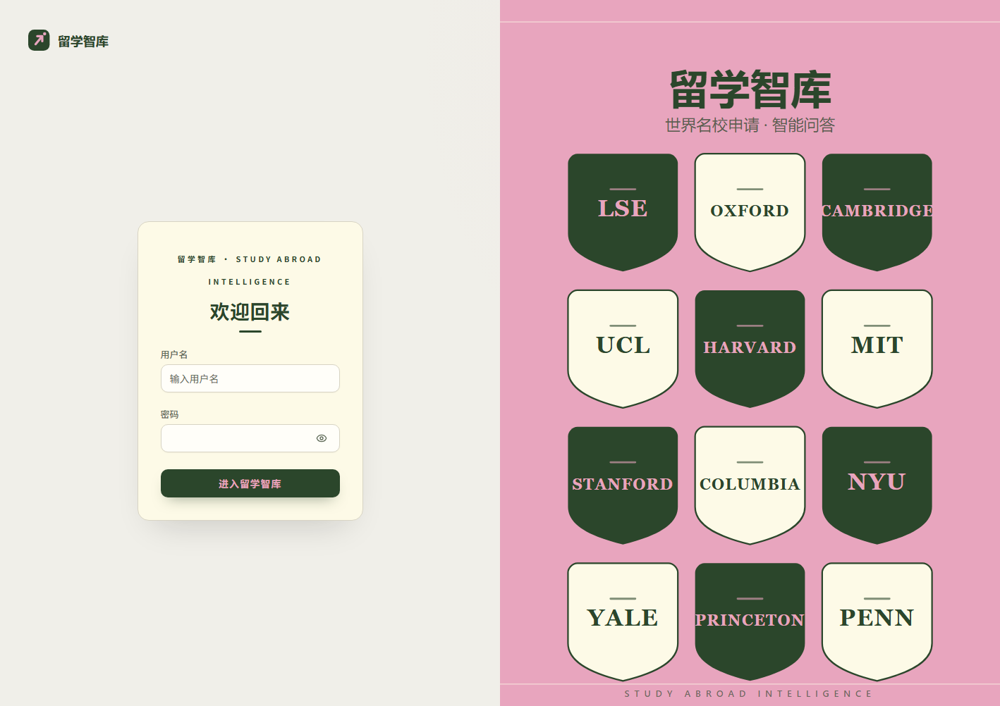
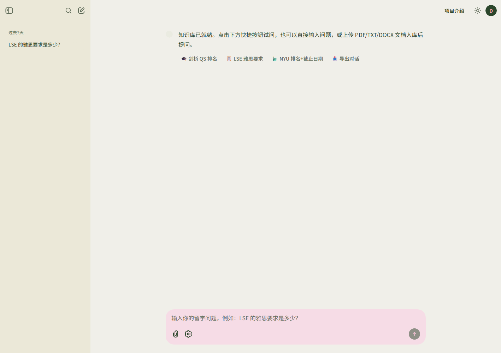

# 留学智库 —— 留学申请文档问答知识库（RAG 多智能体）

[](https://www.python.org/)
[](https://github.com/langroid/langroid)
[](LICENSE)
[](https://platform.deepseek.com)

基于 [Langroid](https://github.com/langroid/langroid) 构建的留学申请问答 Agent：把 LSE、NYU 等院校官网的申请要求（语言成绩、截止日期、学费、文书要求……）变成可提问的知识库，配套 QS 排名查询，把「查一所学校的申请信息」从翻 5 个官网页面变成一句话提问。

## ✨ 功能亮点

- 🤖 **多智能体架构** —— 主 Agent 调度两个工具：`ranking_lookup`（QS 排名/城市查询）+ `doc_qa`（文档问答，回答带来源引用）
- 🎯 **自建评测体系** —— 46 题三层指标（检索命中 / 工具路由 / 答案正确）全部满分（19/19 + 46/46 + 46/46），含 5 道「防编造」题
- 🧠 **受控对话记忆** —— 显式记忆窗口 + 指代消解，多轮追问「那这所学校呢？」正确解析；查不到的宁可拒答也不编造
- 💬 **Web 会话中心** —— 侧栏历史会话/新建会话，断线或刷新后完整恢复（消息 + 对话记忆）；密码登录可开关；快捷问题按钮、模型切换、一键导出 Markdown、回答附「📚 引用来源」卡片
- 📡 **数据管道** —— QS 排名一条命令自动更新（自动校验揪出人工漏掉的错）；官网爬虫定向采集申请要求，来源可溯
- 🛡️ **模型输出容错** —— DeepSeek 偶发原生 DSML 工具调用（约 1/5 轮），双路解析修复，工具不再偶发失效

## 🛠 技术栈

Python 3.12 · Langroid 0.67.7（多智能体 + RAG 框架）· Chainlit（Web 界面）· Qdrant（向量库）· fastembed（BAAI/bge-small-zh-v1.5 中文向量）· DeepSeek

## 🏗 架构

```
用户提问
   │
   ▼
主 ChatAgent（ReAct 工具调度，判断问题类型）
   ├── ranking_lookup 工具 ──► 本地 QS 排名数据（校名模糊匹配）
   └── doc_qa 工具 ──────────► DocChatAgent 子 Agent
                                 ├─ 向量检索（Qdrant + 中文 embedding）
                                 └─ 带 [^n] 来源引用回答
```

核心文件：[chat.py](chat.py)（CLI 入口）· [web_ui.py](web_ui.py)（Chainlit Web）· [tools.py](tools.py)（自定义工具）· [doc_qa.py](doc_qa.py)（文档问答子 Agent）· [eval.py](eval.py)（评测）· [update_rankings.py](update_rankings.py) + [crawler.py](crawler.py)（数据管道）

## 🖥 界面与演示





![问答画面：带 [^n] 来源引用的回答 + 引用来源卡片](docs/screenshot_qa.png)

## 🚀 快速开始

1. 安装依赖（Python 3.12；清华镜像）：

   ```powershell
   .\.venv\Scripts\python.exe -m pip install -r requirements.txt
   ```

2. 编辑 `.env`，填入 DeepSeek 密钥（[platform.deepseek.com](https://platform.deepseek.com) 获取）：

   ```
   DEEPSEEK_API_KEY=sk-xxxxx
   ```

3. （可选）为 Web 界面加登录口令：在 `.env` 设置 `CHAINLIT_WEB_PASSWORD=你的密码`
   （不设置则无登录页；登录时用户名可任意填写，`CHAINLIT_AUTH_SECRET` 建议按
   `.env.example` 说明生成，否则每次重启后需重新登录）

4. 运行（`run.ps1` 自动设置 UTF-8；`-m deepseek/deepseek-reasoner` 可换 R1 模型）：

   ```powershell
   .\run.ps1 docs   # CLI 问答：用示例文档测试，输入 x 退出
   .\web.ps1        # Web 界面：浏览器打开 http://localhost:8001
   ```

## 📄 技术基础与致谢

- 本项目构建于 [Langroid](https://github.com/langroid/langroid) v0.67.7（MIT License，Copyright (c) 2023 langroid）之上：框架以 pip 依赖引入，定制方式为**子类化**（`tools.py` 的 `DeepSeekChatAgent` 继承 `ChatAgent` 并覆写 `get_tool_messages`），未复制任何框架源码
- 其余依赖（Chainlit / Qdrant / fastembed 等）各自遵循其开源协议
- 本项目自身代码以 MIT License 发布（见 [LICENSE](LICENSE)）

📚 技术细节与调优实录（架构决策、故障排查、评测三轮调优）见 **[docs/interview.md](docs/interview.md)**
